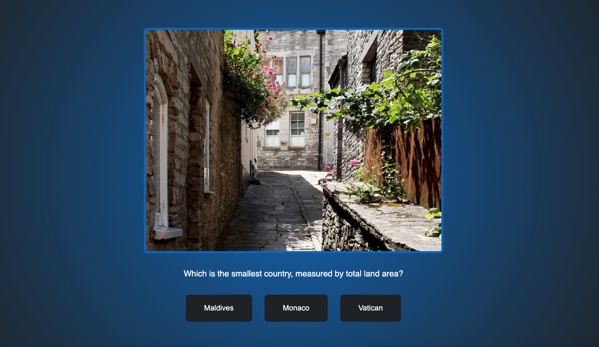

# Quiz

In this project, you can find movies. You can search for movies either by title or by release year. The respective movies will then be displayed. Additionally, there are different filters that can be used to filter movies. Moreover, new movies can be added, and ones that are no longer available can be deleted from the database.

## Table of Contents

- [Overview](#overview)
  - [Screenshot](#screenshot)
  - [Links](#links)
- [My process](#my-process)
  - [Built with](#built-with)
  - [What I learned](#what-i-learned)
  - [Continued development](#continued-development)
  - [Useful resources](#useful-resources)
- [Author](#author)

## Overview

### Screenshot

#### Desktop:

#### Modal for adding movie

#### Flowchart

#### Starting Project

#### Project in Progress

### Links

- Solution URL: [index.html](https://github.com/wilhelm-lenz/movie-database/blob/main/index.html)
- Solution URL: [style.css](https://github.com/wilhelm-lenz/movie-database/blob/main/assets/css/style.css)
- Solution URL: [main.js](https://github.com/wilhelm-lenz/movie-database/blob/main/assets/js/main.js)
- Live Page URL: [Movie Database Live](https://wilhelm-lenz.github.io/movie-database/)

## My Process

### Built With

- Semantic HTML5 markup
- SCSS custom properties
- JavaScript

### What I Learned

During the development of this application, I faced various challenges that I had to overcome. In particular, when selecting genres, I realized that the movies did not update immediately upon clicking, but only after clicking on another genre. This reminded me of the onChange event. With this, the browser can react immediately to changes, and only the movies with the correct genre are displayed.

### Continued Development

In the next phase of development, the focus will be on refactoring the code to improve modularity. Also, adherence to best practices will be emphasized to streamline the code in general. The HTML structure will also be revised for more semantics, and later responsiveness will be added to the project.

### Nützliche Ressourcen

- Netlify - [@app.netlify](https://app.netlify.com/drop/) [@netlify](https://netlify.com): Netlify is a development platform that enables scaling a web application. For example, a programmed web application can easily be converted into a mobile web app.

## Autor

- Wilhelm Lenz - [@wilhelm-lenz](https://github.com/wilhelm-lenz)
